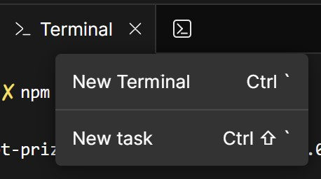

# Prize Giveaway demo using Voice JS Client SDK

This demo can be used to giveaway prizes at events.

## How it works
* The admin logs in and creates a prize wheel (Conversation)
* 2 links are generated: 1 for the prize wheel and 1 for the players
* Admin goes to the prize wheel link and logs in.
* Click "Show QR Code" to have players join the giveaway. When done, close the dialog.
* Click "Spin".
* The prize wheel will spin and select a winner.
* An app to app voice call will be made to the winner.
* Closing the winner dialog will remove the winner from the prize wheel. 

## Elements used
* Vonage Client SDK [documentation](https://developer.vonage.com/en/vonage-client-sdk/overview)
* < prize-wheel > Web Component [documentation](https://github.com/Vonage-Community/web_component-javascript-prize_wheel)
* Shoelace QR Code Web Component [documentation](https://shoelace.style/components/qr-code)

## Getting started
* <a href="https://githubbox.com/conshus/prize-wheel-app-to-app" target="_blank">Deploy (open in a new tab/window)</a> the application to [CodeSandbox.io](https://codesandbox.io).
* In the project window of CodeSandbox.io's terminal section (towards the bottom), click the icon (>_) to show the menu to create a new terminal window or press <kbd>CTRL `</kbd>.

* In the terminal, run the command:
```bash
npm run setup
```
* Follow the steps of the setup.
* That's it! The application should be up and running.
